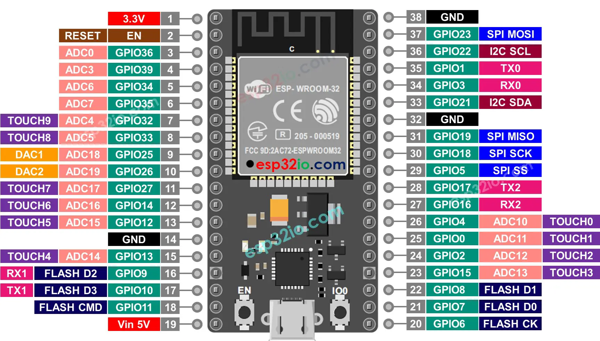

+++
title = "How to: Indoor weather station with an ESP32, temperature / humidity sensor, touch sensor and 16x2 LCD display"
date = "2023-10-10T18:50:29+02:00"
description = " "
+++
-> [code](https://github.com/Yodale1000/Moxd-lab-Makerspace/blob/main/introduction.ino)

# What we need

- [esp32 (ESP32-WROOM-32U)](https://docs.espressif.com/projects/esp-idf/en/latest/esp32/hw-reference/esp32/get-started-devkitc.html)
- [temperature and humidity sensor (dht11)](https://wiki.seeedstudio.com/Grove-TemperatureAndHumidity_Sensor/)
- [16x2 segments lcd (with i2c interface)](https://wiki.seeedstudio.com/Grove-LCD_RGB_Backlight/)
- [touch sensor](https://wiki.seeedstudio.com/Grove-Touch_Sensor/)
- [jumper cable](https://www.amazon.de/Female-Female-Male-Female-Male-Male-Steckbr%C3%BCcken-Drahtbr%C3%BCcken-bunt/dp/B01EV70C78)

# Hardware



| esp32   | dht11 |
|---------|-------|
| GND     | GND   |
| 3V      | VCC   |
| GPIO 16 | SIG   |

| esp32   | touch sensor |
|---------|--------------|
| GND     | GND          |
| 3V      | VCC          |
| GPIO 17 | SIG          |

| esp32   | lcd display |
|---------|-------------|
| GND     | GND         |
| 5V      | VCC         |
| GPIO 36 | SCL         |
| GPIO 33 | SDA         |

# Software

1. Install the [Arduino IDE](https://www.arduino.cc/en/software).
2. Search and install the board dependencies under: Tools -> Board -> Borads Manager -> "Arduino ESP32 Boards".
3. Select "ESP32-WROOM-DA Module" as the board to use after the installation process.
4. Search and install the following dependecies for our sensor and display under: Tools -> Manage Libraries... :

   - [Grove Temperature And Humidity Sensor](https://github.com/Seeed-Studio/Grove_Temperature_And_Humidity_Sensor)
   - [Grove - LCD RGB Backlight](https://github.com/Seeed-Studio/Grove_LCD_RGB_Backlight)

5. Select a port. There should be a port available under: Tools -> Port.
6. Copy and paste the following code into the open scetch.
7. Upload vie the upload button and enjoy your very own indoor weather station. The backlight of the lcd should light up if you touch the touch sensor and stay on for 5 seconds.

```c
#define DHTTYPE DHT11
#define DHTPIN 16

#include <Wire.h>
#include "rgb_lcd.h"
#include "DHT.h"

DHT dht(DHTPIN, DHTTYPE);
rgb_lcd lcd;

const int TouchPin=17;

void setup() // this runs just one time
{
    dht.begin(); // initialize the temperature and humidity sensor
    lcd.begin(16, 2); // initialize the lcd
    lcd.setRGB(0, 0, 0); // turn the lcd backlight off
    pinMode(TouchPin, INPUT); // set the touch sensor pin to behave as an input 
}

void loop() // thise repeats all the time
{
    if(digitalRead(TouchPin)==1) // if the touch sensor is pressed
    {
        float humidity = dht.readHumidity();  // get the humidity
        float temperature = dht.readTemperature(); // and the temperature
        
        lcd.display(); // turn the lcd on
        lcd.setRGB(0, 255, 0); // set the lcd backlight to green
        
        lcd.setCursor(0,0); // start at the first row and first column of the lcd
        lcd.print("Hum: "); // print "Hum: "
        lcd.print(humidity); // and the corresponding humidity
        lcd.setCursor(0,1); // set the cursor to the second row and first column
        lcd.print("Temp: "); // print "Temp: "
        lcd.print(temperature); // and the corresponding temperature
        
        delay(5000); // wait 5 seconds
        
        lcd.noDisplay(); // turn the lcd off
        lcd.setRGB(0, 0, 0); // and also turn the backlight off

    }
}
```