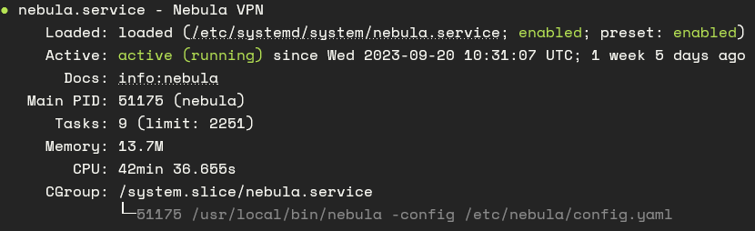

+++
title = "How to: Create an overlay network with Nebula"
date = "2023-10-02T21:53:30+02:00"
description = "A quick guide to create an overlay network with nebula"
+++

# Installation

Get the latest version of Nebula from their github [repo](https://github.com/slackhq/nebula/releases).

```bash
wget https://github.com/slackhq/nebula/releases/download/v1.7.2/nebula-linux-amd64.tar.gz
tar -xzf nebula-linux-amd64.tar.gz
```

# Creating a certificate authority

```bash
./nebula-cert ca -name "Myorganization, Inc"
```

this will create a `ca.key` and `ca.crt`

# Creating a lighthouse

```bash
./nebula-cert sign -name "lighthouse1" -ip "192.168.100.1/24"
```

# Creating a host

```bash
./nebula-cert sign -name "laptop" -ip "192.168.100.2/24"
```

# Configuration

Download a copy of the nebula exampe configuration.

```bash
curl -o config.yml https://raw.githubusercontent.com/slackhq/nebula/master/examples/config.yml
cp config.yml config-lighthouse.yaml
cp config.yml config.yaml
```

# Lighthouse configuration

Remove any entry from `static_host_map` and set `am_lighthouse` to `true`

```bash
static_host_map:
  
lighthouse:
    am_lighthouse: true
```

# Host configuration

Set the ip of your lighthouse accordingly and also set the accoding parameters for the lighthouse.

```bash
static_host_map:
    '192.168.100.1': ['<your ip>:4242']

lighthouse:
    am_lighthouse: false
    interval: 60
    hosts:
        - '192.168.100.1'
```

# Firewall Configuration

```bash
firewall:
    outbound:
        # Allow all outbound traffic from this node
        - port: any
        proto: any
        host: any

    inbound:
        # Allow all between any nebula hosts
        - port: any
        proto: any
        host: any
```

# Running Nebula

1. Copy the nebula binary to `/usr/local/bin`
2. Create a directory for nebula `mkdir nebula /etc/`
3. Move all needed files to the new directory 
    ```bash
    mv config-lighthouse.yaml /etc/nebula/config.yaml
    mv ca.crt /etc/nebula/ca.crt
    mv lighthouse.crt /etc/nebula/host.crt
    mv lighthouse.key /etc/nebula/host.key
    ```
4. Create the following system service `/etc/systemd/system/nebula.service`

    ```bash
    [Unit]
    Description=Nebula VPN
    Documentation=info:nebula
    After=network.target
    Wants=network.target

    [Service]
    Type=simple
    WorkingDirectory=/etc/nebula
    ExecStart=/usr/local/bin/nebula -config /etc/nebula/config.yaml
    ExecReload=/bin/kill -HUP $MAINPID
    KillMode=mixed
    Restart=on-failure
    RestartSec=5
    TimeoutStopSec=5

    [Install]
    WantedBy=multi-user.target
    ```
5. Enable the nebula service with `sudo systemctl enable nebula.service`
6. Start the nebula service with `sudo systemctl start nebula.service`

If everything workd `sudo systemctl status nebula` should show something like this



and if you try to ping the host or lighthouse with their respective ip you assigned to them, `ping 192.168.100.1` or `ping 192.168.100.2`, you should receive a reply.